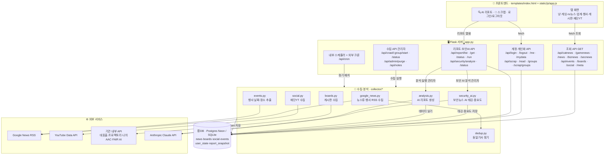

# 🛠 개발 노트 — 휴 스코프

> 📌 **고정 메모 (베타 공개 전 할 것)**
> - **진단 엔드포인트 잠그기**: `/api/peek`, `/api/apihunt`, `/api/grep`, `/api/grepall`, `/api/dbcheck`, `/api/ytcheck`, `/api/img` 가 현재 공개 상태다. peek/grep/img 계열은 우리 서버로 임의 URL을 대신 요청하는 오픈 프록시라 악용 위험 → 관리자 전용(`_admin_ok`)으로 잠그거나 제거할 것.
> - **테스트 계정 정리**: 일반 로그인 `tester1~tester10 / 1234` 는 테스트용이며 로그인 창에 힌트가 노출돼 있다. 실제 공개 전에는 힌트 제거·비번 변경 또는 정식 계정 체계로 교체할 것.
> - **AI 리포트**는 `ANTHROPIC_API_KEY` 가 있어야 동작한다(유료 API). 없으면 리포트 탭의 "분석 실행"만 비활성이고 나머지는 정상.

휴 스코프의 구조·운영·설정을 정리한 문서입니다. 재단/업계 **뉴스·게시판·유튜브 데이터**를 자동 수집해 모바일 웹으로 보여주고, 그 데이터로 **AI 동향 분석 리포트**까지 생성하는 서비스입니다.

---

## 0. 한눈에 보기

- **앱**: 파이썬 Flask 하나로 동작(웹 화면 + 수집기 + 분석 엔진).
- **호스팅**: Render (웹 서비스). 유료 인스턴스라 잠들지 않음.
- **데이터베이스**: 외부 Postgres(`DATABASE_URL`). 서버가 재시작돼도 데이터 유지.
- **정기 수집**: 앱 내부 스케줄러 + 외부 크론(cron-job.org)이 주기적으로 수집 실행.
- **출처**: 구글 뉴스 RSS(뉴스류·행사), 각 기관 내부 API(게시판), 유튜브 Data API(재단YT).
- **AI 분석**: Anthropic(Claude) API로 재단 동향 인텔리전스 리포트 생성.

---

## 0.5 전체 프로세스 도식 (프론트 → 서버 API → 수집·분석 → 외부 → DB)

> 아래 다이어그램은 GitHub·개발노트 팝업에서 그림으로 렌더됩니다. 화살표는 데이터/호출 방향입니다.

**흐름 요약**
1. **조회**: 프론트가 각 탭 진입 시 `조회 API(GET)`를 호출 → 서버가 **DB**에서 읽어 카드/캘린더로 렌더. (비로그인도 가능)
2. **개인화**: 로그인 후 스크랩/읽음/그룹은 `계정 API`로 **`user_state`** 에 계정별 저장·동기화.
3. **수집**: 관리자 "수집 실행"(`/api/crawl/:group/start`) 또는 **스케줄러/크론**(`/api/cron`)이 `collector/*` 실행 → **외부 소스**(구글뉴스 RSS·유튜브 API·기관 내부 API)에서 가져와 dedup 후 **DB에 upsert**.
4. **AI 리포트**: 관리자 "분석 실행"(`/api/report/run`) → `analysis.py`가 DB의 뉴스·재단YT를 정리해 **Claude API** 호출 → 결과 JSON을 **`report_snapshot`** 에 스냅샷 저장. 열람(`/get`·`/list`)은 누구나.

---

## 1. 탭 구성

| 탭 | 내용 | 수집 방식 |
|---|---|---|
| 🐈 냥정보 | 반려묘 뉴스(사료·행동·제도 등 5개 카테고리) | 구글 뉴스 RSS |
| 🕹 게임정보 | 게임 뉴스(신작·업데이트·e스포츠·업계·콘솔·인디) | 구글 뉴스 RSS |
| nc 뉴스 | NC문화재단/엔씨소프트/자회사(전체·재단·본사·자회사 체크박스) | 구글 뉴스 RSS |
| 📊 업계동향 | 문화·공익 재단 및 주요 재단 뉴스(NC 제외) | 구글 뉴스 RSS |
| 🛡 보안뉴스 | 개인정보·정보보안(유출·해킹·취약점·정책·트렌드, 5개 분류 체크박스) | 구글 뉴스 RSS |
| 📅 행사일정 | 국내 행사(앨범/캘린더, 날짜·장소 자동추출) | 구글 뉴스 RSS + 본문 파싱 |
| 📋 재단게시판 | 대표홈페이지·프로젝토리·나의AAC·FAIR AI | 각 사이트 내부 API |
| ▶ 재단YT | NC문화재단 채널(재단) + 주요 재단 유튜브 검색(주요 재단) | 유튜브 Data API |
| 🧠 리포트 | AI 재단 동향 분석 리포트 **(관리자 전용)** | LLM(Anthropic) |

- 뉴스류(냥정보/게임정보/nc/업계동향/보안뉴스/행사)는 모두 `news` 테이블을 쓰고 `section`(cat/game/nc/biz/sec/event) 컬럼으로 구분한다.

---

## 2. 계정 / 권한 / 개인화

- **로그인 유형 2가지** (푸터 우측 로그인 버튼 → 팝업에서 선택):
  - **관리자**: 비밀번호(`ADMIN_PW`). 상태 확인·수집 실행·DB 초기화·개발노트·로그·🧠 리포트가 노출·동작.
  - **일반**: 아이디+비번. 테스트 계정 `tester1~tester10 / 1234`. 스크랩 등 개인 기능만.
- **개인화(로그인 필요, 서버 계정별 저장)**:
  - **스크랩**: 카드 우상단 북마크. 헤더 🔖 스크랩 → 풀팝업에서 목록, **검색 + 커스텀 그룹(다중 소속)** 관리.
  - **읽음 표시**: 원문 링크 클릭 시 읽음 처리(카드 흐리게).
  - 같은 계정이면 다른 기기에서도 동기화된다(`user_state` 테이블).
- **비로그인(방문자)**: 모든 탭 조회·검색·링크 복사 가능. 스크랩/읽음/리포트는 불가.
- **보기 방식**: 리스트/카드 토글(뉴스류·게시판), 행사일정은 앨범/캘린더 토글. 선택은 브라우저에 저장.
- **공통 UI**: 탭별 검색(제목·본문·출처, 조사 제거), 게시물 수 표시, 오늘 등록 글 N 딱지, 카드 링크 복사, 빈 화면 다시 불러오기, 탭바 가로 스크롤+끝 페이드.

---

## 3. 환경변수 (Render → Environment)

- **`DATABASE_URL`** — Postgres 연결 문자열. 있어야 데이터가 영구 저장된다.
- **`ADMIN_PW`** — 관리자 로그인 비밀번호.
- **`SECRET_KEY`** — 로그인 세션 서명 키(긴 무작위 문자열 권장).
- **`CRON_TOKEN`** — 외부 크론 인증 토큰. cron-job.org URL의 `token=` 값과 동일해야 한다.
- **`YOUTUBE_API_KEY`** — 재단YT(NC 채널 전 영상 + 주요 재단 유튜브 검색)에 필요. 없으면 재단은 RSS 최신만, 주요 재단은 건너뜀.
- **`ANTHROPIC_API_KEY`** — 🧠 AI 리포트에 필요(Anthropic Console에서 발급, 유료). 없으면 리포트 생성 불가.
- **`ANALYSIS_MODEL`** — 리포트에 쓸 모델. 기본 `claude-3-5-sonnet-latest`. (선택)
- **`SEC_AI_LIMIT`** — 보안뉴스 🧠 AI 분석 1회 실행당 분석할 기사 수 상한. 기본 `60`. (선택)
- **`SEC_AI_BATCH`** — AI 분석 1회 LLM 호출당 기사 수. 기본 `10`. (선택)
- **`SEC_AI_MAX_TOKENS`** — AI 분석 응답 토큰 상한. 기본 `8000`. (선택)
- **`BACKFILL_DAYS`** — 최초 자동 백필 기간(일). 기본 `1825`(5년).
- **`BATCH_DAYS`** — 정기 배치의 뉴스 수집 창(일). 기본 `30`.
- **`AUTO_BACKFILL`** — 부팅 시 DB 비면 자동 수집할지. 기본 꺼짐(`0`).
- **`ENABLE_SCHEDULER`** — 앱 내부 스케줄러 사용 여부. 기본 켜짐(`1`).
- **`DB_KEEPALIVE_SEC`** — DB keep-alive 주기(초). 기본 `240`, `0`이면 끔.
- **`IMG_ENRICH_MAX`** — 수집 1회당 대표 이미지 보강 개수 상한. 기본 `200`.
- **`EVENT_BODY_MAX`** — 행사일정에서 날짜 추출용으로 본문을 여는 후보 상한. 기본 `400`.

> 비밀값(DB 연결 문자열·비밀번호·토큰·API 키)은 코드나 저장소가 아니라 환경변수에만 둔다.

---

## 4. 수집 동작 (공통)

1. **최초 자동 백필** — DB가 비어 있을 때만(옵션, 기본 꺼짐) 최근 `BACKFILL_DAYS`를 수집.
2. **정기 배치** — 내부 스케줄러 + 외부 크론이 최근 `BATCH_DAYS`만 훑어 새 글 보충.
3. **수동 수집** — 관리자가 각 탭 "수집 실행". 뉴스류는 최근 5년(`RECENT_DAYS`) 기준.

- **중복 방지**: 저장 시 URL 기준 upsert(신규 수 = 저장 전후 개수 차이).
- **탭별 초기화**: 관리자 🗑 초기화는 **현재 탭만** 지운다(뉴스류는 해당 section만).
- **멈춤 방지**: 30분 넘게 진행 중이면 자동 해제. 진행은 서버 백그라운드 + 프론트 폴링.

---

## 5. 탭별 수집 상세

### 뉴스류(구글 뉴스 RSS)
- 기간을 120일 구간으로 나눠 `after:`/`before:` 날짜 검색으로 깊은 과거까지 수집.
- 구글 링크는 리다이렉트라 원문 URL 복원(batchexecute) 후 본문 요약·대표 이미지(og:image) 추출, 실패 시 RSS 요약. 저장 키(url)는 구글 링크로 고정, 실제 기사 주소는 `source_url`.
- 신규가 많으면(>150) 속도를 위해 요약만 저장, 이미지·본문은 이후 조금씩 보강.
- 동일 기사 묶음: 제목/본문 유사도로 그룹화 → 대표 1건 + "N개 매체" 아코디언.
- **nc 뉴스 분류**: 재단(엔씨문화재단) / 본사(엔씨소프트) / 자회사(NC AI·QA·IDS 등)는 클라이언트에서 키워드로 구분(체크박스 다중 선택).

### 행사일정
- AI 한정 없이 국내 행사 전반. 행사장·지역·분야 앵커 검색어.
- 국내 판별: 기본 국내(gl=KR 소스)로 보되, 해외 행사명(CES/MWC)·도시·"해외국가+참가/현지"면 제외.
- 성료(종료) 기사·1년 넘은 기사 제외. **날짜가 확인되는 행사만** 수집(요약에 없으면 본문을 열어 추출, 상한 `EVENT_BODY_MAX`).
- 연도 추정은 **기사 작성일 기준**(오늘 기준이면 과거 기사를 미래로 오인).
- 앨범(카드) + 캘린더(월 그리드 색막대 + 아젠다 목록, 클릭 시 원문).

### 보안뉴스
- 개인정보보호·정보보안 전반: 실제 사고(유출·해킹·랜섬웨어)뿐 아니라 취약점(CVE·제로데이), 정책·법령(개인정보보호법·ISMS·과징금), 보안 트렌드(AI/클라우드 보안·제로트러스트 등)까지.
- **단순 키워드 노출이 아니라 "사고 키워드 + 행위/결과 키워드" 조합**으로 검색(예: `개인정보+유출`, `랜섬웨어+피해`, `취약점+악용`)해 실무 참고가치 위주로 수집.
- 5개 분류(체크박스, 다중선택): **개인정보 / 해킹·침해 / 취약점 / 정책·규제 / 보안트렌드**. 검색어 그룹명을 `category`로 저장하고, 화면에서 체크박스로 필터.
- gl=KR·hl=ko RSS라 국내 매체 중심(국내 관련성)이며, 국내에도 영향이 큰 글로벌 벤더(MS/Google/Apple/AWS 등) 사고도 자연히 포함.
- 광고·홍보·시세성(할인·프로모션·코인 시세·주가·채용 등) 제목은 제외. 동일 사건은 `news` 클러스터링으로 "N개 매체" 묶음.
- **AI 후처리(관리자 🧠 AI 분석)**: 수집된 보안뉴스를 Claude API로 **배치 분석**해 기사별로 자동 태깅·중요도·시사점을 채운다.
  - 태그(복수): 개인정보/개인정보유출/해킹/랜섬웨어/악성코드/피싱·스미싱/취약점/제로데이/계정탈취/데이터유출/공급망공격/클라우드보안/AI보안/보안정책/법령·규제/과징금·제재/보안기술/보안트렌드.
  - 중요도: CRITICAL(심각)/HIGH(높음)/MEDIUM(보통)/LOW(낮음) — 카드에 색 배지. 탭 상단 **최신순/중요도순 정렬 토글**.
  - 시사점: 보안담당자 관점 시사점·조직 확인사항·예방조치(카드에 표시), keep(참고가치 여부) 저장.
  - 세부 필드: 관련 기업/기관·공격유형·CVE·유출/피해 규모·조치/대응(기사 근거 있을 때만, 카드에 칩으로 표시).
  - 저장: `news`의 `ai_tags/ai_importance/ai_insight/ai_at` 컬럼(섹션 재사용, 스키마 마이그레이션 자동). 이미 분석된 기사는 건너뛰고 신규만(증분). 1회 상한 `SEC_AI_LIMIT`.
  - 엔진: `collector/security_ai.py` (리포트와 동일한 `ANTHROPIC_API_KEY`·모델 자동선택 재사용). 키 없으면 수집·필터까지만 동작.

### 재단게시판 (모두 내부 API 연동 완료)
- 대표홈페이지·프로젝토리·나의AAC·FAIR AI. 각 사이트가 목록을 JS로 렌더하는 SPA라 정적 HTML 대신 실제 호출되는 내부 API(JSON)로 수집.

### 재단YT
- **재단** = NC문화재단 채널(@nccf). 키 있으면 업로드 재생목록 전체(Data API), 없으면 RSS 최신.
- **주요 재단** = 업계동향과 동일한 기관 목록으로 유튜브 **검색**(Data API). 공식 채널이 아닌 영상이 섞일 수 있음(키워드 방식). 계정명(account)으로 재단/주요재단 분류.
- (구) 인스타그램 수집은 제거함.

---

## 6. AI 재단 동향 분석 리포트 (🧠 리포트 탭)

목적은 "뉴스 요약"이 아니라 **비교·변화·추세·이상징후·신규신호·근거·검토질문** 중심의 인텔리전스 리포트.

- **파이프라인**: 수집 데이터(우리=nc 재단 + NC문화재단 유튜브 / 동종=업계동향 + 주요 재단 유튜브) → 정리·중복보도 묶기(**미디어 노출량 ≠ 활동 수**) → LLM 분석 → 리포트 JSON → **스냅샷 저장** → 다음 실행 때 지난 리포트와 비교.
- **리포트 9섹션**: ① Executive Brief ② 지난 리포트 이후 변화(NEW/UP/DOWN/CONTINUED/DISAPPEARED) ③ 업계 동향 ④ 재단별 움직임 ⑤ Trend ⑥ Emerging Signals(판단 근거 포함) ⑦ 우리 재단 Position ⑧ Benchmark ⑨ 검토 과제. + 모든 결론에 **근거 원문 드릴다운**.
- **저장**: `report_snapshot` 테이블(실행 시점별 누적) → 스냅샷 선택·비교.
- **엔진**: `ANTHROPIC_API_KEY` 필요. 모델 `ANALYSIS_MODEL`(기본 sonnet).
- **1차 구현 범위**: 끝단 동작(탭·분석·스냅샷·리포트·드릴다운). 심화(정교한 Activity 클러스터링, 1·3·6개월/1·3·5년 기간축 UI, Gap 전용 화면, 신뢰도 지표 표시)는 다음 단계.

---

## 7. 자주 겪는 문제

- **⚠ 임시저장 배지**: `DATABASE_URL` 미반영. 환경변수 확인 후 재배포.
- **DB 연결 실패**: DB 컴퓨트 sleep 또는 연결 문자열 불일치. `/api/dbcheck`(현재 공개)로 원인 확인.
- **행사 0건/적음**: 요약에 날짜 없는 건 제외됨. 본문 파싱 상한(`EVENT_BODY_MAX`)·검색어 확장으로 조정. 뉴스 기반이라 구조적 상한 존재.
- **리포트 "키 없음"**: `ANTHROPIC_API_KEY` 미설정. **모델명 오류**면 `ANALYSIS_MODEL`을 최신 별칭으로.
- **수집 안 됨**: 30분 후 자동 해제. Render Logs에서 `[crawl]`/`[google]`/`[social]` 확인.

---

## 8. 데이터 보존 주의

- `DATABASE_URL` 삭제 시 임시 SQLite로 돌아가 재시작 때 초기화. DB 콘솔에서 프로젝트/DB 삭제 금지.
- 관리자 "DB 초기화"는 해당 탭 데이터를 지운 뒤 재수집한다(되돌릴 수 없음). 리포트 스냅샷·개인 스크랩은 별도 테이블이라 영향 없음.

---

## 9. 링크

- 사이트: https://ncfoundation-collector.onrender.com
- 소개(공유용) 페이지: https://ncfoundation-collector.onrender.com/intro
- 저장소: https://github.com/kksh0379/ncfoundation-collector
- Render: https://dashboard.render.com
- Anthropic Console(API 키): https://console.anthropic.com
- cron-job.org: https://console.cron-job.org

---

## 10. 코드 맵

- `app.py` — 라우트(화면·API), 로그인/계정, DB 보장·keep-alive, 수집 작업·상태, 스케줄러/크론/백필, DB 초기화, 개인화(스크랩/읽음/그룹), 리포트 실행.
- `collector/google_news.py` — 뉴스류 수집(재단/본사·냥정보·게임·업계동향·보안뉴스 카테고리, 구간 분할, 본문/이미지, 필터).
- `collector/events.py` — 행사일정(국내 판별·날짜/장소 추출·본문 파싱 폴백).
- `collector/boards.py` — 게시판 수집(사이트별 내부 API).
- `collector/social.py` — 재단YT(NC 채널 Data API + 주요 재단 유튜브 검색).
- `collector/analysis.py` — AI 리포트(데이터 정리·중복 묶기·LLM 호출·JSON 스키마).
- `collector/security_ai.py` — 보안뉴스 AI 후처리(배치 태깅·중요도·시사점, analysis의 LLM 연결부 재사용).
- `collector/dedup.py` — 동일 기사 그룹화.
- `collector/db.py` — 저장소(Postgres/SQLite, 직접 접속), news/boards/social/events/user_state/report_snapshot.
- `collector/fetcher.py` / `collector/extractor.py` — HTTP 헬퍼 / 본문·이미지 추출.
- `templates/index.html`, `static/js/app.js`, `static/css/style.css` — 앱 화면.
- `templates/intro.html`, `static/intro/*.png` — 서비스 소개(랜딩) 페이지(`/intro`, 로그인·DB 없이 정적).
- `DEVNOTE.md`(이 문서), `CHANGELOG.md`(변경 이력).
